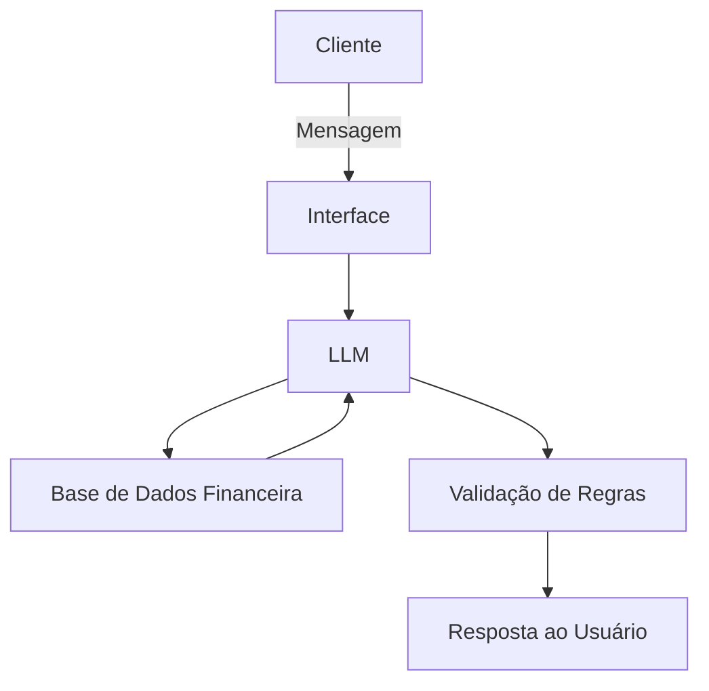

# 💰 Agente de Controle de Inadimplência

## Caso de Uso

### Problema

Empresas enfrentam perda de receita devido a clientes inadimplentes e falta de controle estruturado sobre vencimentos, multas e juros. Muitas vezes, a cobrança é feita manualmente, gerando atrasos, esquecimentos e desgaste no relacionamento com o cliente.

### Solução

O agente monitora automaticamente:

* Datas de vencimento
* Valores em aberto
* Dias em atraso
* Aplicação de multa e juros conforme regra definida

Ele identifica clientes inadimplentes, classifica por nível de atraso e sugere ações de cobrança adequadas (mensagem amigável, reforço formal ou alerta crítico).

Também pode gerar relatórios como:

* Lista de clientes em atraso
* Total a receber
* Juros acumulados
* Ranking de inadimplência

### Público-Alvo

* Pequenas e médias empresas
* Empresas com contratos recorrentes
* Escritórios contábeis
* Empresas que vendem a prazo

## Persona e Tom de Voz

### Nome do Agente

**CobraFácil AI**

### Personalidade

* Organizado
* Objetivo
* Profissional
* Preventivo
* Focado em resultado

O agente age de forma estratégica, priorizando recuperação de receita sem comprometer o relacionamento com o cliente.

### Tom de Comunicação

Formal, claro e direto.

Evita termos agressivos e mantém postura profissional.

### Exemplos de Linguagem

* **Saudação:**
  "Olá. Deseja verificar clientes com vencimento próximo ou em atraso?"

* **Confirmação:**
  "Identifiquei 4 clientes com atraso superior a 10 dias."

* **Alerta:**
  "O valor total em aberto é de R$ 18.450,00."

* **Sugestão:**
  "Recomendo iniciar contato com clientes acima de 15 dias de atraso."

* **Erro/Limitação:**
  "Não encontrei dados de vencimento para este cliente."

## Arquitetura

### Diagrama

---

### Componentes

| Componente           | Descrição                                           |
| -------------------- | --------------------------------------------------- |
| Interface            | Chat interno do CRM ou painel web                   |
| LLM                  | Modelo de linguagem via API                         |
| Base de Conhecimento | Banco de dados com clientes, vencimentos, valores   |
| Validação            | Cálculo automático de juros, multa e dias de atraso |

---

## Segurança e Anti-Alucinação

### Estratégias Adotadas

* ✔ O agente responde apenas com base nos dados cadastrados no sistema
* ✔ Todos os cálculos são demonstráveis
* ✔ Quando não encontra dados, informa claramente
* ✔ Não realiza ações financeiras sem confirmação
* ✔ Não altera valores automaticamente

### Limitações Declaradas

O agente:

* Não realiza cobrança automática sem integração externa
* Não envia protesto ou negativação automática
* Não acessa dados bancários
* Não faz análise jurídica
* Não substitui contador ou departamento financeiro
